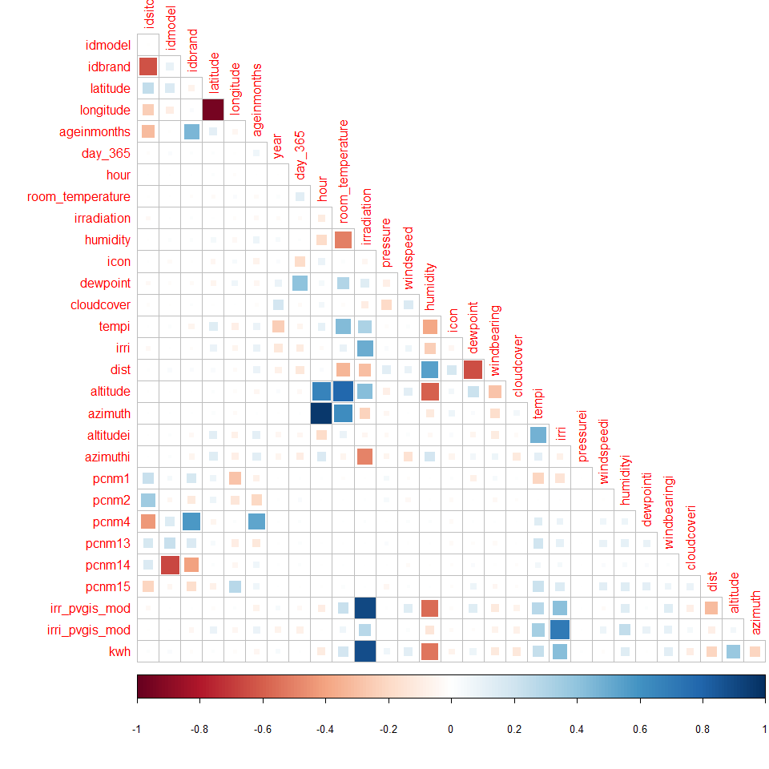
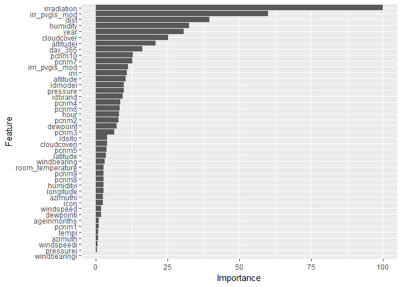

RProject
================
Piotr Jówko
03 grudzień, 2017

Table of contents
=================

1.  [Summary](#summary)
2.  [Used libraries](#libriaries)
3.  [Data loading](#dataLoading)
4.  [Data Cleaning](#cleaning)
5.  [Basic statistics](#baseStats)
6.  [Correlations](#correlations)
7.  [Regressor](#regressor)

<a name="summary"></a> Summary
------------------------------

This analysis had a goal to predict energy output from sonal panels. It was done by creating Linear Regression model. As it shown in this report, irradiation has dominating effect on energy output. Also important is low humidity and cloud cover, right season in year and altitude. RMSE for training and testing subset is very similar.

<a name="libriaries"></a> Used libraries
----------------------------------------

``` r
library(plyr);
library(dplyr);
library(tidyr)
library(ggplot2);
library(corrplot)
library(caret);

set.seed(23);
```

<a name="dataLoading"></a> Data loading
---------------------------------------

Reading data from file:

``` r
panels <- read.csv(file = 'solar_panels.csv')
```

<a name="cleaning"></a> Data Cleaning
-------------------------------------

All rows with any NA values were removed. </br> Columns: id and data were removed. Id is not needed in analysis. </br> Data is redundant, because date is stored in others columns and there it is normalized(ora, day, anno). </br>

``` r
panels <- panels %>% drop_na() %>% select(-id, -data)
```

Some fields were renamed, because they names were confusing, unclear or were in spanish language.

``` r
panels <- panels %>% rename(day_365 = day, latitude = lat, longitude = lon, hour = ora, room_temperature = temperatura_ambiente, irradiation = irradiamento, year = anno)
```

Irradiation with value 0 in middle of a day mean measurement error. All rows with zero values in this column beetwen 8:00 - 16:00 (values beetwen 0.333 and 0.778 in hour column) were removed.<br> Pressure with value 0 also mean sensors malfunction and rows with this values were also removed.

``` r
panels <- filter(panels, irradiation > 0 | hour < 0.333 | hour > 0.778) %>% filter(pressure != 0)
```

<a name="baseStats"></a> Basic statistics
-----------------------------------------

Number of rows and columns:

    ## [1] 198409     49

Data summary:

    ##      idsito          idmodel          idbrand          latitude     
    ##  Min.   :0.0000   Min.   :0.0000   Min.   :0.0000   Min.   :0.4150  
    ##  1st Qu.:0.0750   1st Qu.:0.1250   1st Qu.:0.0830   1st Qu.:0.4360  
    ##  Median :0.2000   Median :0.1670   Median :0.1670   Median :0.4370  
    ##  Mean   :0.1902   Mean   :0.2187   Mean   :0.1724   Mean   :0.4361  
    ##  3rd Qu.:0.3000   3rd Qu.:0.2500   3rd Qu.:0.2500   3rd Qu.:0.4380  
    ##  Max.   :0.4250   Max.   :0.7500   Max.   :0.4170   Max.   :0.5530  
    ##    longitude       ageinmonths          year         day_365      
    ##  Min.   :0.1540   Min.   :0.0000   Min.   :2012   Min.   :0.0000  
    ##  1st Qu.:0.6200   1st Qu.:0.0000   1st Qu.:2012   1st Qu.:0.2600  
    ##  Median :0.6250   Median :0.0630   Median :2012   Median :0.4770  
    ##  Mean   :0.6252   Mean   :0.3301   Mean   :2012   Mean   :0.4764  
    ##  3rd Qu.:0.6300   3rd Qu.:0.8440   3rd Qu.:2013   3rd Qu.:0.6850  
    ##  Max.   :0.6910   Max.   :1.0000   Max.   :2013   Max.   :1.0000  
    ##       hour        room_temperature  irradiation        pressure     
    ##  Min.   :0.0000   Min.   :0.1520   Min.   :0.0000   Min.   :0.7300  
    ##  1st Qu.:0.2220   1st Qu.:0.2120   1st Qu.:0.0000   1st Qu.:0.7510  
    ##  Median :0.5000   Median :0.3640   Median :0.0500   Median :0.7530  
    ##  Mean   :0.5063   Mean   :0.3797   Mean   :0.1174   Mean   :0.7531  
    ##  3rd Qu.:0.7780   3rd Qu.:0.5300   3rd Qu.:0.2220   3rd Qu.:0.7560  
    ##  Max.   :1.0000   Max.   :0.8180   Max.   :0.7100   Max.   :0.7690  
    ##    windspeed          humidity           icon           dewpoint     
    ##  Min.   :0.00000   Min.   :0.1600   Min.   :0.0000   Min.   :0.2960  
    ##  1st Qu.:0.04500   1st Qu.:0.5200   1st Qu.:0.0830   1st Qu.:0.5430  
    ##  Median :0.07200   Median :0.6800   Median :0.6670   Median :0.6250  
    ##  Mean   :0.07975   Mean   :0.6695   Mean   :0.4621   Mean   :0.6116  
    ##  3rd Qu.:0.10700   3rd Qu.:0.8200   3rd Qu.:0.6670   3rd Qu.:0.6870  
    ##  Max.   :0.69600   Max.   :1.0000   Max.   :0.7500   Max.   :0.8650  
    ##   windbearing       cloudcover         tempi             irri       
    ##  Min.   :0.0000   Min.   :0.0000   Min.   :0.0380   Min.   :0.1080  
    ##  1st Qu.:0.3170   1st Qu.:0.2400   1st Qu.:0.0730   1st Qu.:0.2160  
    ##  Median :0.4880   Median :0.3100   Median :0.1120   Median :0.2200  
    ##  Mean   :0.4609   Mean   :0.3487   Mean   :0.1224   Mean   :0.2222  
    ##  3rd Qu.:0.6660   3rd Qu.:0.4900   3rd Qu.:0.1270   3rd Qu.:0.2220  
    ##  Max.   :0.7690   Max.   :1.0000   Max.   :0.6530   Max.   :1.0000  
    ##    pressurei          windspeedi        humidityi         dewpointi     
    ##  Min.   :0.00e+00   Min.   :0.01700   Min.   :0.03400   Min.   :0.0630  
    ##  1st Qu.:0.00e+00   1st Qu.:0.03700   1st Qu.:0.04400   1st Qu.:0.1140  
    ##  Median :0.00e+00   Median :0.03800   Median :0.04400   Median :0.1140  
    ##  Mean   :3.84e-05   Mean   :0.03844   Mean   :0.06344   Mean   :0.1193  
    ##  3rd Qu.:0.00e+00   3rd Qu.:0.03900   3rd Qu.:0.05900   3rd Qu.:0.1180  
    ##  Max.   :1.00e+00   Max.   :0.27700   Max.   :0.57900   Max.   :0.2660  
    ##   windbearingi     cloudcoveri          dist           altitude     
    ##  Min.   :0.0000   Min.   :0.0490   Min.   :0.0000   Min.   :0.1110  
    ##  1st Qu.:0.3360   1st Qu.:0.1960   1st Qu.:0.1749   1st Qu.:0.4210  
    ##  Median :0.3360   Median :0.1960   Median :0.4317   Median :0.5660  
    ##  Mean   :0.3448   Mean   :0.2057   Mean   :0.4531   Mean   :0.5526  
    ##  3rd Qu.:0.3370   3rd Qu.:0.1980   3rd Qu.:0.7104   3rd Qu.:0.6860  
    ##  Max.   :1.0000   Max.   :1.0000   Max.   :1.0000   Max.   :0.8840  
    ##     azimuth         altitudei        azimuthi          pcnm1       
    ##  Min.   :0.1280   Min.   :0.011   Min.   :0.0180   Min.   :0.0000  
    ##  1st Qu.:0.2970   1st Qu.:0.095   1st Qu.:0.2070   1st Qu.:0.3770  
    ##  Median :0.4220   Median :0.132   Median :0.2770   Median :0.3780  
    ##  Mean   :0.4558   Mean   :0.197   Mean   :0.3582   Mean   :0.4204  
    ##  3rd Qu.:0.6380   3rd Qu.:0.254   3rd Qu.:0.4730   3rd Qu.:0.3800  
    ##  Max.   :0.8170   Max.   :0.883   Max.   :0.9010   Max.   :1.0000  
    ##      pcnm2            pcnm3            pcnm4           pcnm5       
    ##  Min.   :0.0000   Min.   :0.0000   Min.   :0.000   Min.   :0.0000  
    ##  1st Qu.:0.1460   1st Qu.:0.5500   1st Qu.:0.360   1st Qu.:0.1530  
    ##  Median :0.3520   Median :0.6050   Median :0.531   Median :0.4270  
    ##  Mean   :0.3509   Mean   :0.6015   Mean   :0.517   Mean   :0.4107  
    ##  3rd Qu.:0.4530   3rd Qu.:0.7470   3rd Qu.:0.773   3rd Qu.:0.5410  
    ##  Max.   :0.9720   Max.   :1.0000   Max.   :1.000   Max.   :1.0000  
    ##      pcnm6            pcnm7           pcnm8            pcnm9       
    ##  Min.   :0.0000   Min.   :0.000   Min.   :0.0000   Min.   :0.0000  
    ##  1st Qu.:0.3320   1st Qu.:0.017   1st Qu.:0.1540   1st Qu.:0.4830  
    ##  Median :0.4840   Median :0.049   Median :0.4120   Median :0.5320  
    ##  Mean   :0.4995   Mean   :0.115   Mean   :0.4034   Mean   :0.5379  
    ##  3rd Qu.:0.7650   3rd Qu.:0.112   3rd Qu.:0.5160   3rd Qu.:0.7550  
    ##  Max.   :1.0000   Max.   :1.000   Max.   :1.0000   Max.   :1.0000  
    ##      pcnm10           pcnm11           pcnm12           pcnm13      
    ##  Min.   :0.0000   Min.   :0.0000   Min.   :0.0000   Min.   :0.1370  
    ##  1st Qu.:0.5430   1st Qu.:0.2520   1st Qu.:0.7480   1st Qu.:0.5970  
    ##  Median :0.6190   Median :0.3210   Median :0.7870   Median :0.6510  
    ##  Mean   :0.6281   Mean   :0.3246   Mean   :0.7576   Mean   :0.6571  
    ##  3rd Qu.:0.8120   3rd Qu.:0.3900   3rd Qu.:0.9720   3rd Qu.:0.8320  
    ##  Max.   :1.0000   Max.   :1.0000   Max.   :1.0000   Max.   :1.0000  
    ##      pcnm14           pcnm15       irr_pvgis_mod    irri_pvgis_mod   
    ##  Min.   :0.0000   Min.   :0.0000   Min.   :0.0000   Min.   :-0.0090  
    ##  1st Qu.:0.4240   1st Qu.:0.6120   1st Qu.:0.0000   1st Qu.: 0.1580  
    ##  Median :0.4730   Median :0.6140   Median :0.0730   Median : 0.1900  
    ##  Mean   :0.4892   Mean   :0.5728   Mean   :0.1891   Mean   : 0.1965  
    ##  3rd Qu.:0.5390   3rd Qu.:0.6150   3rd Qu.:0.3520   3rd Qu.: 0.2140  
    ##  Max.   :1.0000   Max.   :1.0000   Max.   :1.0000   Max.   : 1.0060  
    ##       kwh        
    ##  Min.   :0.0000  
    ##  1st Qu.:0.0000  
    ##  Median :0.0620  
    ##  Mean   :0.1752  
    ##  3rd Qu.:0.3430  
    ##  Max.   :1.0000

<a name="correlations"></a> Correlations
----------------------------------------

In thi step correlation matrix is calculated(correlation with each pair of columns). <br> For clarity some rows(with no correlation greater than 0.4 or less than -0.4) are not shown on plot.

``` r
corMatrix <- cor(panels)

# Change diagonal values from 1 to 0. Needed for weak correlations removal.
for(i in 1:dim(corMatrix)[1]) {
    corMatrix[i, i] <- 0;
}

# Remove "weak" correlations.
strongCor <- corMatrix[apply(corMatrix, MARGIN = 1, function(x) any(x > 0.40 | x < -0.40)), ]

corrplot(strongCor, method = "square", type="lower", diag=FALSE)
```



As it seen on chart, kwh have strong positive correlation with irriadiation and strong negative correlation with humidity with is obvious. Altitude has positive impact on energy output. There is also positive correlation beetwen temperature and energy output, with probably is connected with time of day and irriadiation.

<a name="regressor"></a> Regressor
----------------------------------

70% of records were choosen to teach model and 30% to validate and test. Prepare data for regressor:

``` r
inTraining <- createDataPartition(y = panels$kwh, p = .70, list = FALSE)

training <- panels[ inTraining,]
testing  <- panels[-inTraining,]

ctrl <- trainControl(method = "repeatedcv", number = 5, repeats = 5)
```

Train model with linear regression:

``` r
fit <- train(kwh ~ ., data = training, method = "lm", metric="RMSE", trControl = ctrl)
fit
```

    ## Linear Regression 
    ## 
    ## 138887 samples
    ##     48 predictor
    ## 
    ## No pre-processing
    ## Resampling: Cross-Validated (5 fold, repeated 5 times) 
    ## Summary of sample sizes: 111110, 111109, 111110, 111110, 111109, 111109, ... 
    ## Resampling results:
    ## 
    ##   RMSE        Rsquared   MAE       
    ##   0.08968416  0.8206102  0.05644522
    ## 
    ## Tuning parameter 'intercept' was held constant at a value of TRUE

Variable importance:

``` r
predictedValues <- predict(fit, newdata = testing)

# show variable importance
ggplot(varImp(fit))
```



As we can see on a chart, irradiation dominates over other variables. Altitute and dist is important and have positive impact on energy output. Cloud cover and humidity have high negative impact on energy output. Also year and day have positive impact on energy output. This is probably related to seasons.

Summary:

    ##       RMSE   Rsquared        MAE 
    ## 0.08856064 0.82569529 0.05597381

    ## 
    ## Call:
    ## lm(formula = .outcome ~ ., data = dat)
    ## 
    ## Residuals:
    ##      Min       1Q   Median       3Q      Max 
    ## -0.63683 -0.03546 -0.00303  0.03094  1.05827 
    ## 
    ## Coefficients: (5 not defined because of singularities)
    ##                    Estimate Std. Error t value Pr(>|t|)    
    ## (Intercept)      -5.857e+01  1.203e+00 -48.687  < 2e-16 ***
    ## idsito           -1.694e-01  2.546e-02  -6.653 2.88e-11 ***
    ## idmodel          -1.358e-01  8.480e-03 -16.016  < 2e-16 ***
    ## idbrand           3.501e-01  2.293e-02  15.267  < 2e-16 ***
    ## latitude          4.778e+00  8.279e-01   5.771 7.91e-09 ***
    ## longitude         8.931e-01  2.018e-01   4.425 9.65e-06 ***
    ## ageinmonths       1.260e-02  6.394e-03   1.971  0.04877 *  
    ## year              2.754e-02  5.587e-04  49.292  < 2e-16 ***
    ## day_365           3.025e-02  1.151e-03  26.272  < 2e-16 ***
    ## hour             -4.926e-02  3.684e-03 -13.370  < 2e-16 ***
    ## room_temperature -1.359e-02  2.882e-03  -4.716 2.41e-06 ***
    ## irradiation       8.327e-01  5.197e-03 160.244  < 2e-16 ***
    ## pressure          8.831e-01  5.539e-02  15.942  < 2e-16 ***
    ## windspeed         1.771e-02  5.430e-03   3.262  0.00111 ** 
    ## humidity         -1.252e-01  2.400e-03 -52.158  < 2e-16 ***
    ## icon              4.265e-03  1.008e-03   4.230 2.34e-05 ***
    ## dewpoint          5.189e-02  4.425e-03  11.726  < 2e-16 ***
    ## windbearing      -6.311e-03  1.209e-03  -5.219 1.80e-07 ***
    ## cloudcover       -5.507e-02  1.360e-03 -40.500  < 2e-16 ***
    ## tempi             1.102e-02  6.655e-03   1.657  0.09759 .  
    ## irri              5.976e-01  3.416e-02  17.492  < 2e-16 ***
    ## pressurei        -4.428e-02  5.979e-02  -0.741  0.45893    
    ## windspeedi        8.433e-02  7.852e-02   1.074  0.28282    
    ## humidityi         2.843e-02  6.408e-03   4.437 9.13e-06 ***
    ## dewpointi        -6.055e-02  1.977e-02  -3.063  0.00219 ** 
    ## windbearingi     -9.905e-04  7.677e-03  -0.129  0.89734    
    ## cloudcoveri      -5.700e-02  8.883e-03  -6.416 1.40e-10 ***
    ## dist              1.086e-01  1.707e-03  63.641  < 2e-16 ***
    ## altitude          5.824e-02  3.425e-03  17.007  < 2e-16 ***
    ## azimuth          -7.460e-03  5.228e-03  -1.427  0.15359    
    ## altitudei        -8.053e-02  2.388e-03 -33.715  < 2e-16 ***
    ## azimuthi         -1.047e-02  2.390e-03  -4.381 1.18e-05 ***
    ## pcnm1             2.388e-02  1.237e-02   1.931  0.05348 .  
    ## pcnm2             6.423e-02  5.002e-03  12.843  < 2e-16 ***
    ## pcnm3            -8.273e-02  7.885e-03 -10.492  < 2e-16 ***
    ## pcnm4            -9.742e-02  7.062e-03 -13.794  < 2e-16 ***
    ## pcnm5             3.602e-02  5.699e-03   6.321 2.61e-10 ***
    ## pcnm6            -1.049e-01  7.831e-03 -13.396  < 2e-16 ***
    ## pcnm7            -1.636e-01  7.921e-03 -20.649  < 2e-16 ***
    ## pcnm8             1.141e-02  2.512e-03   4.541 5.60e-06 ***
    ## pcnm9            -5.030e-03  1.098e-03  -4.580 4.65e-06 ***
    ## pcnm10           -1.296e-01  6.191e-03 -20.927  < 2e-16 ***
    ## pcnm11                   NA         NA      NA       NA    
    ## pcnm12                   NA         NA      NA       NA    
    ## pcnm13                   NA         NA      NA       NA    
    ## pcnm14                   NA         NA      NA       NA    
    ## pcnm15                   NA         NA      NA       NA    
    ## irr_pvgis_mod     2.908e-01  3.028e-03  96.045  < 2e-16 ***
    ## irri_pvgis_mod   -1.401e-01  7.738e-03 -18.106  < 2e-16 ***
    ## ---
    ## Signif. codes:  0 '***' 0.001 '**' 0.01 '*' 0.05 '.' 0.1 ' ' 1
    ## 
    ## Residual standard error: 0.08967 on 138843 degrees of freedom
    ## Multiple R-squared:  0.8207, Adjusted R-squared:  0.8207 
    ## F-statistic: 1.478e+04 on 43 and 138843 DF,  p-value: < 2.2e-16
